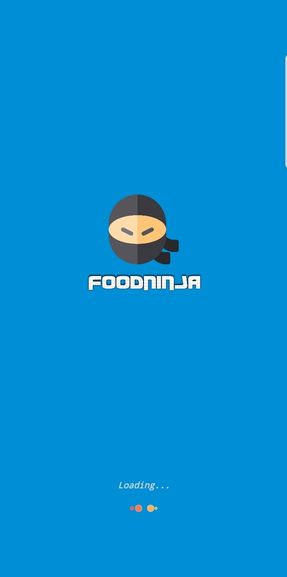

# Android app

## Descriere

Aplicatia Android este cel de-al doilea client al proiectului. Aceasta este conectata la cele doua [API-uri implementate](../Api's) si comunica cu acestea prin intermediul protocolului HTTP prin metode POST si GET in vederea manipularii datelor din baza de date din Azure.

### Demo

**Loading activity**

**Login activity**

**Register activity**

**Recipe list activity**

**Recipe stats activity**

**Submit recipe dialog**

